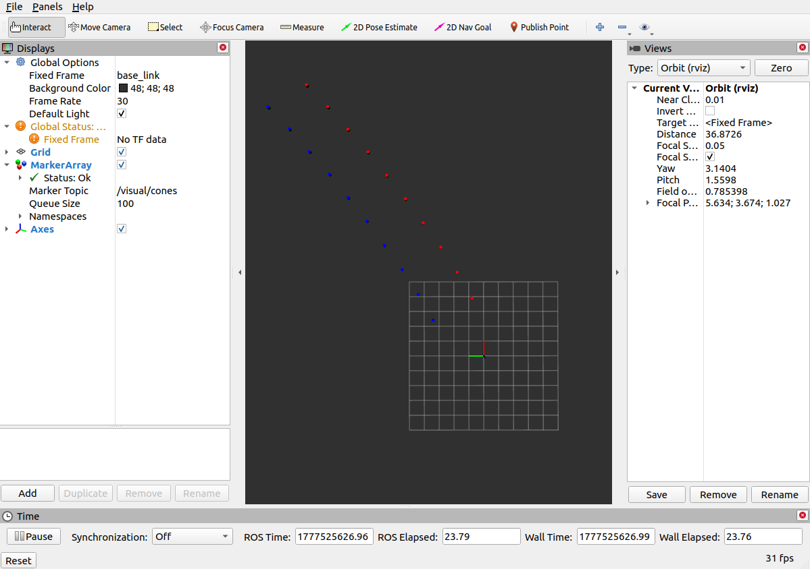

# Cone Visualization ROS Workspace
<br>

- 本工作空间用于回放 `rosbag` 数据包，订阅解析 `/test/camera_cones` 锥桶话题，接收到相机视角下的锥桶数据，先转换成米制，再进行从相机到车体坐标系的转换，然后利用预期计算好的旋转矩阵，进行车体坐标系内锥桶坐标的旋转变换，完成锥桶坐标在相机坐标系到车体坐标系的转换，并在 `rviz` 中可视化展示。
<br>

## 📡 话题与节点说明
<br>

- rosbag 原始数据源话题：`/test/camera_cones`
- 数据解析订阅节点：`/demo01_sub`
- 中转发布话题：`/car/cones`
- rviz 可视化订阅节点：`/visualization_rviz`
- rviz 可视化发布话题：`/visual/cones`
<br>

## 🚀 运行步骤
<br>

- 1.进入工作空间(`fifth_week_cone_visualization_ws`文件夹)，然后在工作空间主目录下打开终端
- 2. 在终端内编译并刷新环境
```bash
catkin_make
source devel/setup.bash
 ```
- 3. 一键启动所有节点
 ```bash
roslaunch plumbing_pub_sub task.launch 
 ```
<br>

## 🖥️ 预期结果
<br>

- 运行成功后，rviz将可视化锥桶，效果如下：

